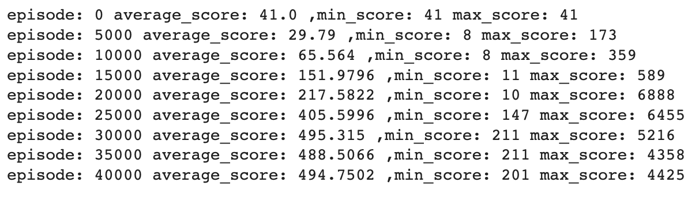

# Comp562-Final-Report
This is a final project for Comp562 May 2023.

# Content:
1. The code is in the main.py file.
2. The report is Comp562Report.pdf file.
3. The TEX file of our report is in the ReportinLatex.tex file.
4. The Jupyter Notebook of our code is in the Cartpole-q-learning.ipynb file.
5. image1.png and image2.png are our outputs/results.

## Cart Pole-Q Learning

### Problem and application

  The cart pole game is a well-known problem in the field of control theory and has been widely used to test reinforcement learning algorithms. In this game, a pendulum with a center of gravity above its pivot point is attached to a cart that moves horizontally along a track. The goal is to keep the pendulum balanced by applying appropriate forces to the cart.

Despite its apparent simplicity, this game is challenging for humans to control. The pendulum is inherently unstable, and even small disturbances can cause it to fall over. It requires continuous adjustments and quick reactions to maintain its balance. Achieving a high score in this game is no easy task.

To address this challenge, machine learning techniques such as reinforcement learning have been used to train agents to control the cart pole game. Reinforcement learning involves training an agent to make decisions based on feedback in the form of rewards or punishments. By repeating the game thousands of times, the agent can learn from its failures and achieve a high score by avoiding the actions that lead to failure.

The implementation of machine learning in the cart pole game is not only critical for solving this specific game problem. It is also for showing machine learning's effectiveness in solving real world problems. By mastering this game using machine learning algorithms, we can gain insights into more complex problems that involve decision-making in dynamic environments. Additionally, machine learning can be used to control physical systems in robotics and other fields.

### Motivation

The rapid advancements in machine learning and artificial intelligence have paved the way for innovative solutions across various domains. Among these, reinforcement learning has shown great promise in enabling machines to master complex tasks autonomously. The motivation behind our project, Cart Pole- Q learning, is to harness the power of Q-learning, a model-free reinforcement learning algorithm, to excel in the car-pole game. This game serves as a valuable benchmark for evaluating the adaptability and learning capabilities of our model. By achieving high scores in the car-pole game, we aim to demonstrate the potential of Q-learning algorithms for real-world applications, such as self-driving cars and robotics. Additionally, our project seeks to contribute to the ongoing research in reinforcement learning, inspiring further exploration and innovation in this exciting field.

### Survey related work
In our project, we focused on implementing and evaluating the Q-learning algorithm for the cart-pole problem. Our primary goal was to demonstrate the effectiveness of the Q-learning approach in learning to balance the pole and achieve high scores in the game. Since our project was centered around the development and analysis of the reinforcement learning model, conducting a survey was not relevant to the scope of our work. The project's success was assessed through the performance metrics of the trained agent, rendering survey-related work unnecessary for the evaluation of our approach.
  
 
 
### Approach

We approach the cart-pole problem using the Q-learning algorithm. The Python code provided demonstrates the complete process, from setting up the environment to training the model and evaluating its performance.

First, we import the required libraries and create the cart-pole environment using OpenAI Gym. To balance the trade-off between exploration and exploitation, we employ an epsilon-greedy strategy, where epsilon decays over time, allowing the agent to explore initially and exploit learned knowledge later.

The Q-table is initialized with a random uniform distribution and is updated iteratively during training. We discretize the continuous state space into bins to create a manageable Q-table size. To update the Q-table, we follow the standard Q-learning update rule, considering the learning rate and discount factor. A negative reward is assigned when the pole falls over or goes out of bounds.

Our training process consists of a pre-defined number of episodes. During each episode, the agent interacts with the environment by selecting an action based on the epsilon-greedy strategy and updating the Q-table accordingly. The agent's performance is evaluated every 5,000 episodes by calculating the average, minimum, and maximum scores.

After the training is completed, we visualize the agent's performance in the cart-pole environment by rendering the game in "human" mode. This allows us to observe how well the agent has learned to balance the pole and achieve high scores.

### Results and conclusion

The results of our project demonstrate the effectiveness of the Q-learning algorithm in learning to balance the cart-pole. As the training progressed, we observed significant improvements in the agent's performance, particularly in average scores. The figures below show the performance metrics at different episodes during the training:

Episode 0: As the starting point, the agent had an average score of 41, with a minimum and maximum score of 41.
Episode 5,000: The agent's average score increased to 29.79, with a minimum score of 8 and a maximum score of 173.
Episode 10,000: At this stage, the agent achieved an average score of 65.564, with a minimum score of 8 and a maximum score of 359.
Episode 15,000: The agent's performance improved further, achieving an average score of 151.9796, a minimum score of 11, and a maximum score of 589.
Episode 20,000: With more training, the agent's average score reached 217.5822, with a minimum score of 10 and a maximum score of 6888.
Episode 25,000: The agent continued to improve, achieving an average score of 405.5996, a minimum score of 147, and a maximum score of 6455.
Episode 30,000: The average score increased to 495.315, with a minimum score of 211 and a maximum score of 5216.
Episode 35,000: The agent maintained its performance, achieving an average score of 488.5066, a minimum score of 211, and a maximum score of 4358.
Episode 40,000: In the final evaluation, the agent achieved an average score of 494.7502, with a minimum score of 201 and a maximum score of 4425.
  
These results indicate that the Q-learning algorithm successfully learned an effective policy for the cart-pole problem. As training progressed, the agent's average score increased, suggesting that it was learning to balance the pole more effectively over time. 
 
However, there were fluctuations in the minimum and maximum scores. The fluctuations in the scores during the training process can be partially explained by the exploration-exploitation trade-off, initial Q-table initialization, and learning rate. The epsilon-greedy strategy employed in our approach allows the agent to explore the action space by taking random actions with a probability of epsilon, which decays over time. During the exploration phase, the agent may take suboptimal actions, leading to lower scores. Furthermore, the initial Q-table is populated with random values, which may cause the agent to make poor decisions in the early stages of training. As the learning progresses, the Q-table converges to more accurate estimates of state-action values, but occasional fluctuations may still occur. The learning rate also plays a crucial role in the stability of the learning process. A high learning rate may cause the agent to overfit to recent experiences, leading to instability in performance, while a low learning rate might slow down the learning process, causing the agent to take longer to find the optimal policy. Balancing these factors is essential for achieving stable and optimal learning outcomes in reinforcement learning tasks such as the cart-pole problem. 

Although there were fluctuations in the minimum and maximum scores,  the overall trend indicates a successful implementation of Q-learning in solving the cart-pole problem.
